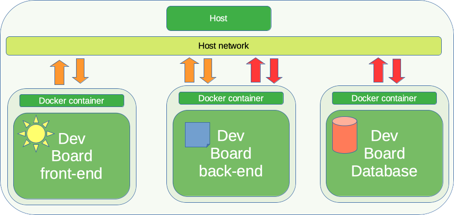
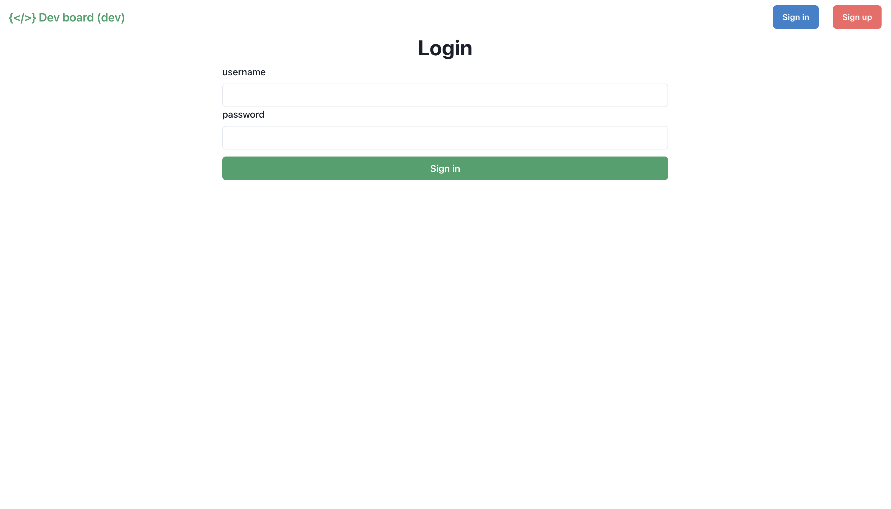
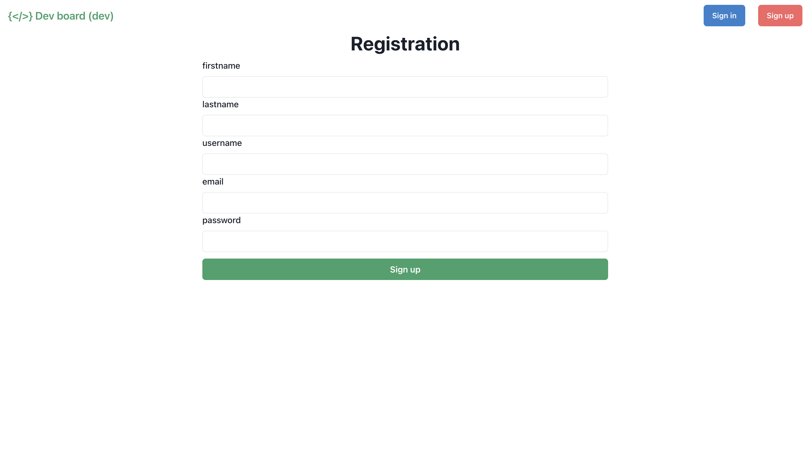
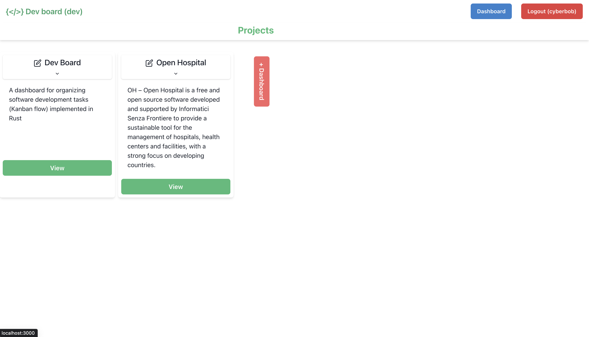
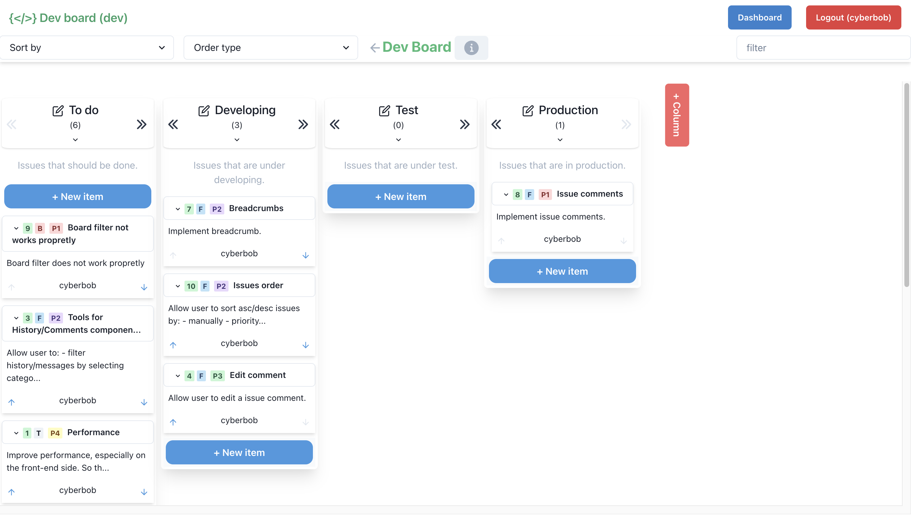
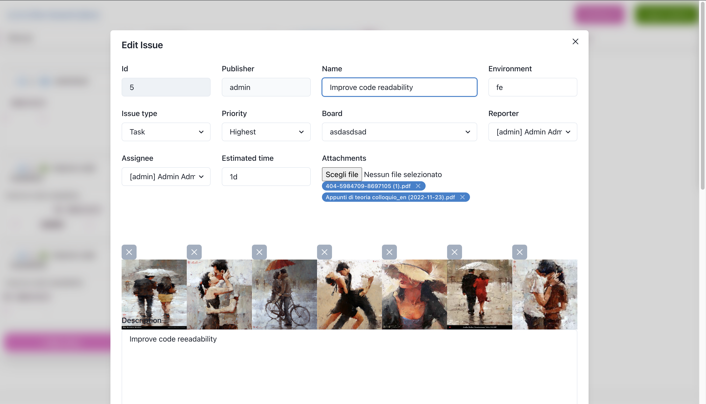
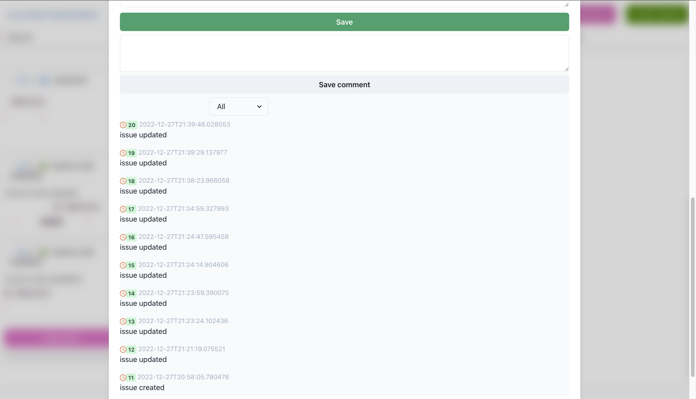

```
==========================================================================================
=       ===        ==  ====  ============      ======    =======  =====       ===       ==
=  ====  ==  ========  ====  ============  ===  ====  ==  =====    ====  ====  ==  ====  =
=  ====  ==  ========  ====  ============  ====  ==  ====  ===  ==  ===  ====  ==  ====  =
=  ====  ==  ========  ====  ============  ===  ===  ====  ==  ====  ==  ===   ==  ====  =
=  ====  ==      ====   ==   ==        ==      ====  ====  ==  ====  ==      ====  ====  =
=  ====  ==  =========  ==  =============  ===  ===  ====  ==        ==  ====  ==  ====  =
=  ====  ==  =========  ==  =============  ====  ==  ====  ==  ====  ==  ====  ==  ====  =
=  ====  ==  ==========    ==============  ===  ====  ==  ===  ====  ==  ====  ==  ====  =
=       ===        =====  ===============      ======    ====  ====  ==  ====  ==       ==
==========================================================================================
```

### Dev Board (React)

A Kanban flow application. Implementation of the front-end for [dev_boar_api_rust](https://github.com/goto-eof/dev_board_api_rust). Developed with TypeScript, React and Chakra UI.

# Architecture



### Run application

```sh
npm install
```

```sh
npm run start
```

### Run application in the docker container

```sh
docker-compose up
```













if any problems arise, feel free to [contact me](https://andre-i.dev/#contactme).

P.S. clean local storage before use.
