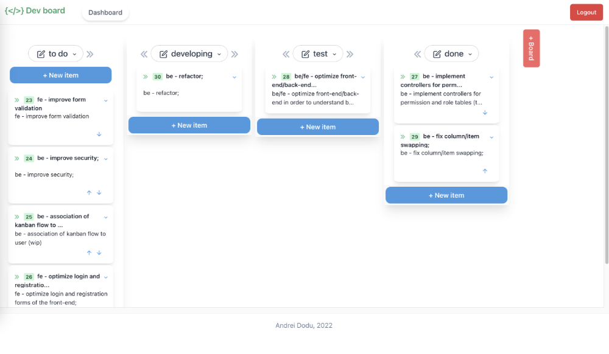
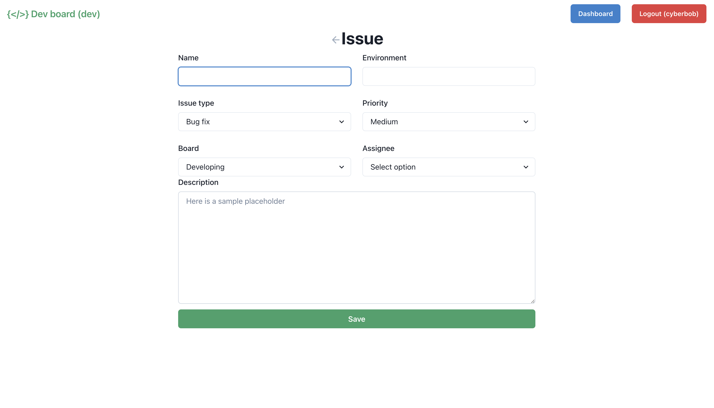
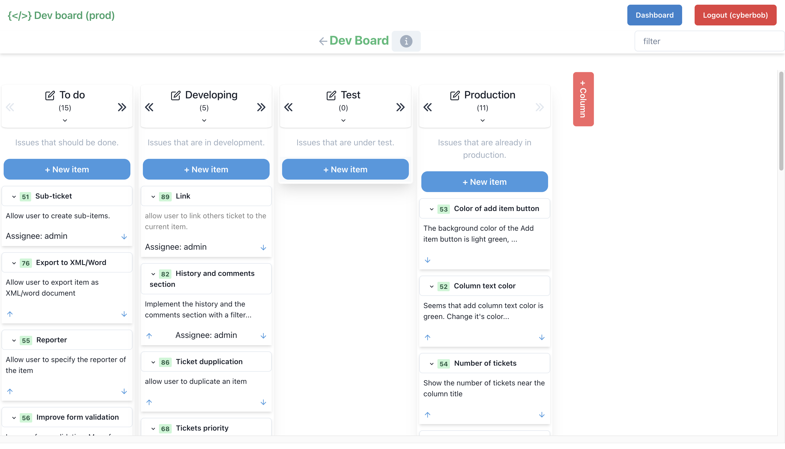

### Dev Board (React)

A Kanban flow application. Implementation of the front-end for [dev_boar_api_rust](https://github.com/goto-eof/dev_board_api_rust). Developed with TypeScript, React and Chakra UI.

### Run application

```sh
npm install
```

```sh
npm run start
```

### Run application in the docker container

```sh
docker-compose up
```







if any problems arise, feel free to [contact me](https://andre-i.dev/#contactme).
